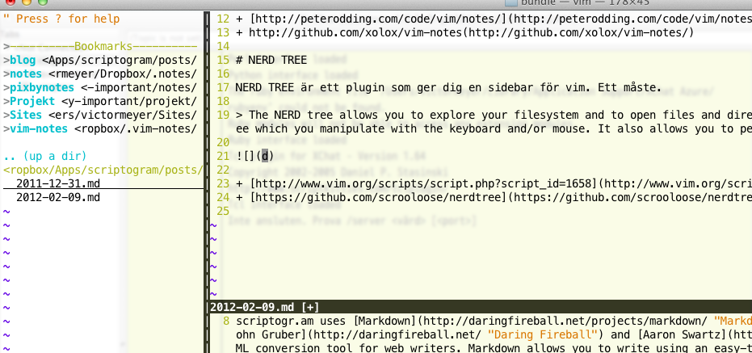

## notes.vim

> The notes.vim plug-in makes it easy to manage your notes in Vim by providing several (automatic) commands and an advanced syntax mode. For more information about the plug-in please refer to its homepage or the project page on GitHub:

- [http://peterodding.com/code/vim/notes/](http://peterodding.com/code/vim/notes/)
- [http://github.com/xolox/vim-notes](http://github.com/xolox/vim-notes/)

## NERDTree

> The NERD tree allows you to explore your filesystem and to open files and directories. It presents the filesystem to you in the form of a tree which you manipulate with the keyboard and/or mouse. It also allows you to perform simple filesystem operations.

- [http://www.vim.org/scripts/script.php?script_id=1658](http://www.vim.org/scripts/script.php?script_id=1658)
- [https://github.com/scrooloose/nerdtree](https://github.com/scrooloose/nerdtree "Latest dev version")
