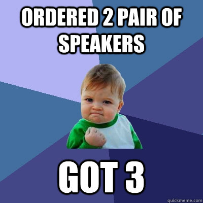
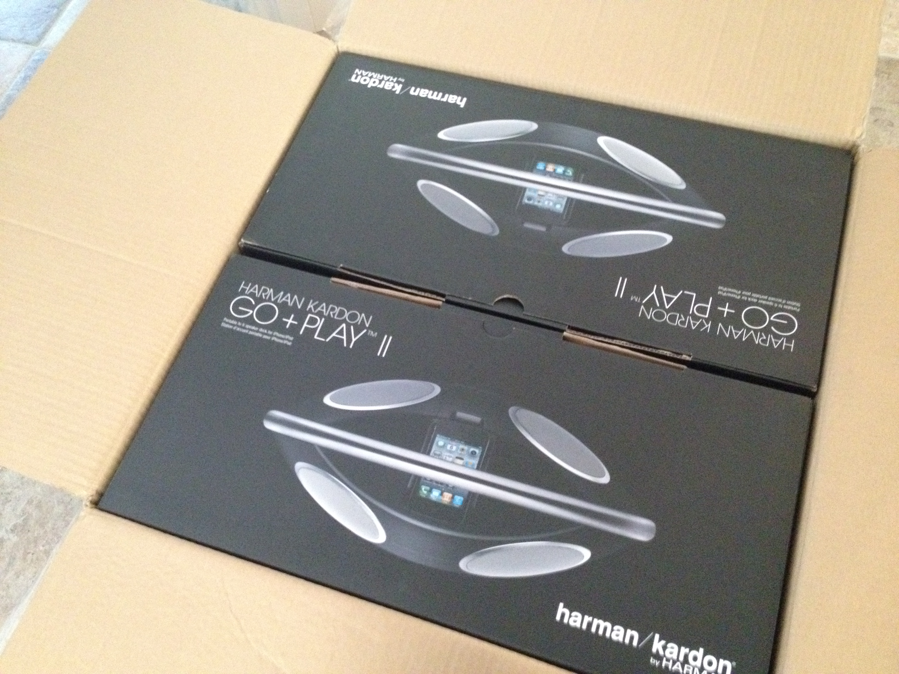
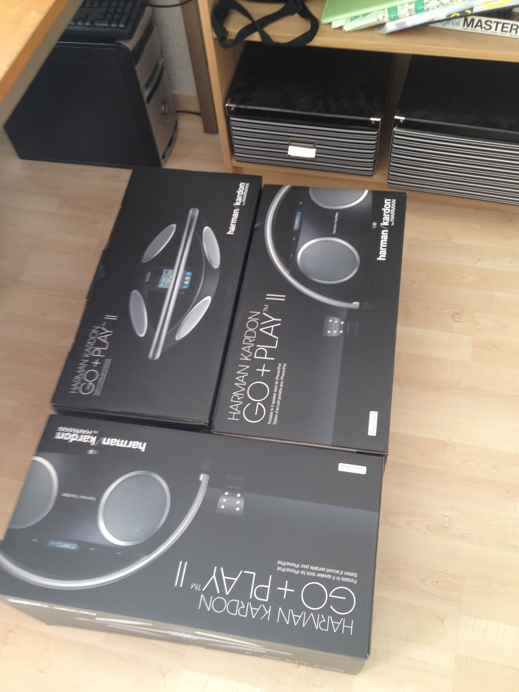

I ordered 2 portable speakers (Harman Kardon Go + Play II) and yesterday I received a text, saying that a package had arrived for me. Happy I walked down and carried the 13.7 kg heavy package home.

At the post office I did see that the package said "Kolli 1/2", implying that this was one package of two… I asked if there were any more laying around for me, and got told "no.." (Lucky for me, I would not have managed carrying anymore anyway).

Unpacking when I got home; Baaam, there they are – picture below. Everything in order. Lovely sound.

**2012-08-14 16.08.53** (aaah happy to unbox)

## Where it gets good

The next day, when walking home from work, I get another text. Saying that I have another package waiting for me. I turn around and start walking back to the post office. I was actually waiting for another delivery (a breadmaker), so I was not surprised (yet).

**WTF**, the breadmaker is not waiting for me.  
Instead; another pair of speakers!

> **Me:** _"I've already got the two pair of speakers"._  
> **Post man:** _Oh, now you got three_

So yeah, at the moment my household got 3 pair of Harman Kardon Go + Play II. Net worth of 2390:- each.

**2012-08-15 16.16.59** (MORE SPEAKERZ??)

