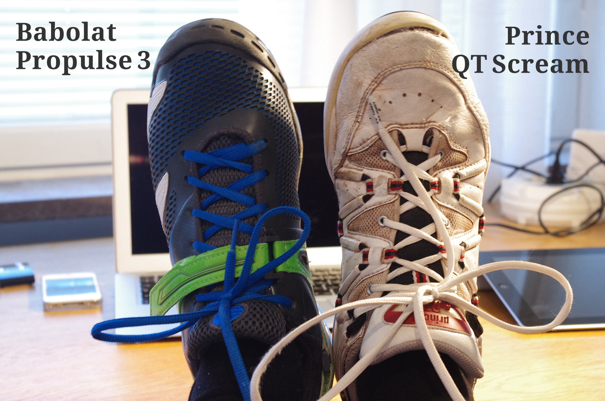
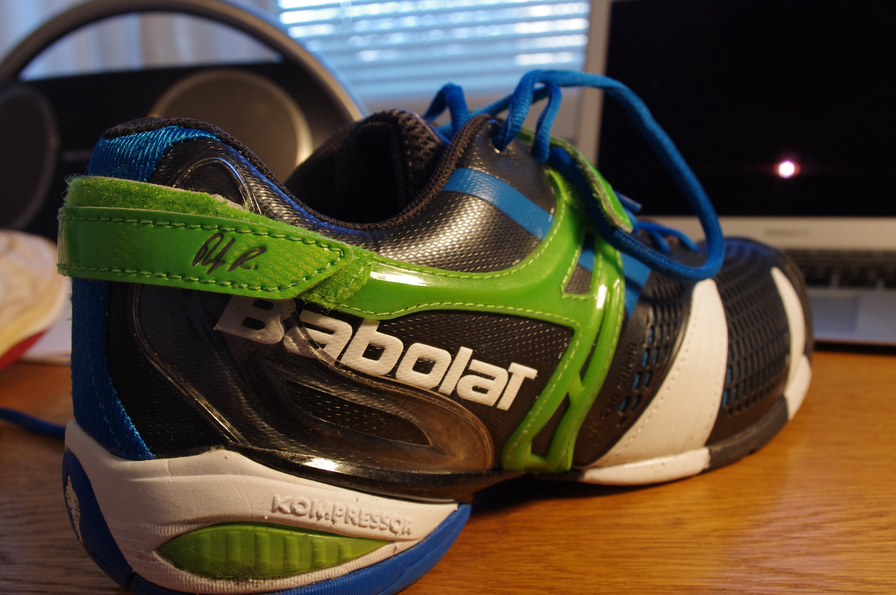

The day has come. My last pair of Prince QT Scream - a tennis shoe model I've had for ages, is worn out. It was my fourth pair, and my old love is nowhere to be found on the Swedish market. The obvious replacement for this shoe would be any shoe in Prince's T-series. And yeah, T-22 / T-24 seems nice.

> When researching different models, I found that QT Scream is _still_ produced by a Company called Ektelon, and then under the name: **Ekteblon QT Scream**, and they can be found over @ [Zappos](http://www.zappos.com/ektelon-qt-scream-mid-white-black-red). It seems like Ektelon are the manafacturer producing the shoes, and Prince is just putting their brand on them.

However, it was time for change - and I got the Babolat Propulse instead. I can't really tell wether or not I like the Propulse more then Scream. But it feels good, and I will maby update this post when I've played some more.

## Pros & Cons

- Overall great fit
- Faster (maby more stiff) then the Scream
- Not that nice heal cushion
- Not as "stable"
