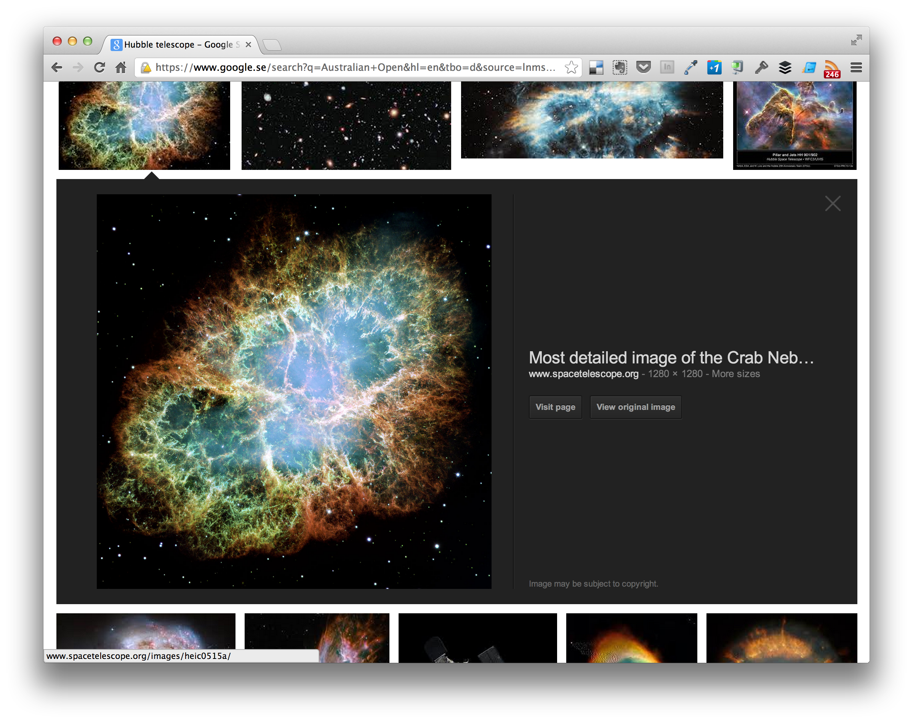
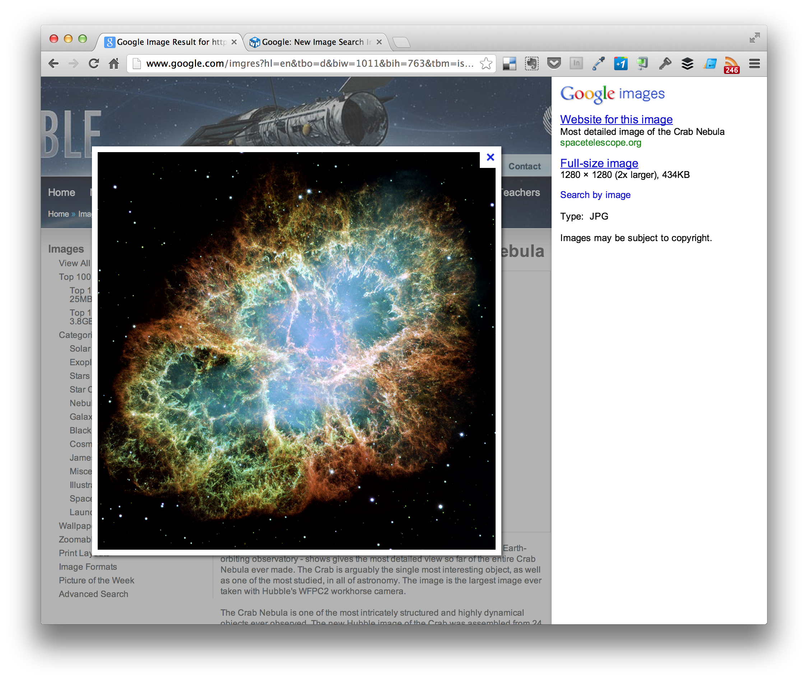

Google has launched the new format/interface for its "Image Search". An update we all longed for, and most probably an update Google should have done several years ago.

**The new format**, is faster, more intuitive, and better looking. When clicking a thumbnail, you get an enlarged inline version, together with useful metadata.

**The old format**, offered a small "hover-state", but if you wanted to see the image in a larger version, you were redirected to the actual web page it was taken from (as seen above). An overall crappy experience.

**The consequences**, of this change will maby result in fewer page visits for the content authors. But the majority of those visits were forced. The new format instead that gives you the option to "Visit Page".
