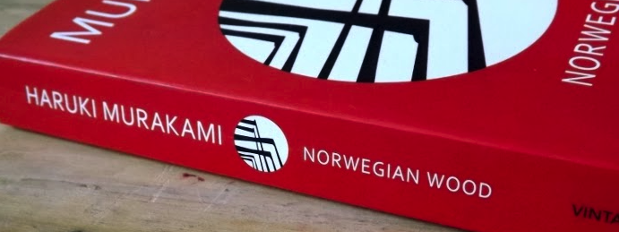

Haruki Murakami's book [Norwegian Wood](<https://en.wikipedia.org/wiki/Norwegian_Wood_(novel)>) really hit a nerve with me. It's an emotional roller coaster for the hopeless romantic (read: me). The book is about Toru Watanabe, who looks back on his days as a college student living in Tokyo.

The focus of the book is around mental illness and depression, and the biggest take away (to me) is explained in the very beginning of the book where Naoko tells Toro about a "field well".

> It lay precisely on the border where the meadow ended and the woods began - a dark opening in the earth a yard across, hidden by grass. Nothing marked its perimeter - no fence, no stone curb (at least not one that rose above ground level). It was nothing but a hole, a wide-open mouth. The stones of its collar had been weathered and turned a strange muddy-white. They were cracked and chunks were missing, and a little green lizard slithered into an open seam. You could lean over the edge and peer down to see nothing. All I knew about the well was its frightening depth. It was deep beyond measuring, and crammed full of darkness, as if all the world's darknesses had been boiled down to their ultimate density. "It's really, really deep," said Naoko, choosing her words with care. She would speak that way sometimes, slowing down to find the exact word she was looking for. "But no one knows where it is," she continued. "The one thing I know for sure is that it's around here somewhere."

What Naoko is describing to Toru here is the traits of depression for which the "field well" serves as a symbol. That it's impossible to know when you will fall into it, and how far you will fall. When first reading it I had no clue what Naoko meant, but after I finished the book I couldn't think of anything else but this well. Just like Toru himself, eighteen years later.

> Let's see, now, what was Naoko talking about that day? Of course: the "field well".

Love is hard, especially when paired with mental illness. Haruki does an excellent job at putting words to these feelings that can many times be hard to describe. I enjoyed getting to know all the quirky, broken, but all so lovely characters - which I reflect upon below.

### Toru

Toru is the main character. A very calm and collected individual but has his own unique way. He has integrity and doesn't care too much about what other people think. I respect that.

> "It was as if I were writing letters to hold together the pieces of my crumbling life."

### Naoko

Naoko is this beautiful, fragile and emotionally unstable girl that Toru falls in love with, but Naoko is not capable of returning that love. I feel that their relationship, although beautiful, is an unlucky one for Toru. Most of the love is played out in Toru's brain rather than in the interaction between the two. How much do you sacrifice for love?

> "Will you wait for me forever?"

### Midori

It's interesting how Naoko and Midori are complete polar opposites. Midori is (in contrast to Naoko) outspoken, passionate and provocative.

> "I'm a real, live girl, with real, live blood gushing through my veins. You're holding me in your arms and I'm telling you that I love you. I'm ready to do anything you tell me to do. I may be a little bit mad, but I'm a good girl, and honest, and I work hard, I'm kind of cute, I have nice boobs, I'm a good cook, and my father left me a trust fund. I mean, I'm a real bargain, don't you think? If you don't take me, I'll end up going somewhere else."

### Reiko

Reiko is Naoko's older roommate and serves as the voice of reason in the otherwise oh-so complicated story. I think we all need a friend like Reiko in our lives.

> "Things like that happen all the time in this great big world of ours. It's like taking a boat out on a beautiful lake on a beautiful day and thinking both the sky and the lake are beautiful. So stop eating yourself up alive. Things will go where they're supposed to go if you just let them take their natural course."

### Nagasawa

Nagasawa is a true psychopath, and I love and hate him for it. He's an interesting guy but oh so arrogant.

> “Don't feel sorry for yourself. Only assholes do that.”

### Closing thoughts

- The book has an open ending, what do you think happened?
- I read this book straight after J.D Salinger's The Catcher in the Rye, and I noticed that they were similar in their ways. Told from a first-person perspective with simple narration. There's even a quote in Norwegian Wood that could possibly be a homage to The Catcher in the Rye?
- They've made a [film](https://www.imdb.com/title/tt1270842/) based on the novel, I have not seen it (yet)

> “I wonder what ants do on rainy days?”
