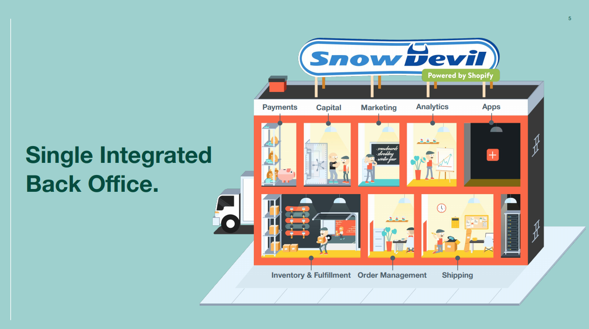

```

                              6
                          Microsoft

                        3          3
                    Activision    BMW

             2          2          2          2
          Alphabet    Amazon     Apple      Shopify

        1          1          1          1          1
       AMD       Exxon      Nordea     Nvidia     PayPal
```

### Summary

I currently sit with 40% cash and 60% in stocks. Below is a table of my rebalanced portfolio, including some financial figures. **Market cap expressed in billion of dollars.**

| Name               | Weight  | Market cap | Price/Book |    P/E | Dividend |
| :----------------- | :------ | ---------: | ---------: | -----: | -------: |
| Microsoft          | ~~2~~ 6 |    \$1,606 |      13.02 |  34.27 |    0.99% |
| Activision Blizzard | 3       |       \$59 |       4.08 |  26.65 |    0.54% |
| BMW                | 3       |       \$48 |       0.82 |   9.91 |    3.38% |
| Alphabet           | 2       |    \$1,191 |       5.61 |  34.08 |          |
| Amazon             | ~~1~~ 2 |    \$1,564 |      18.90 |  91.14 |          |
| Apple              | 2       |    \$2,017 |      30.82 |  36.17 |    0.67% |
| Shopify            | 2       |      \$117 |      19.08 | 597.14 |          |
| AMD                | 1       |      \$103 |      26.59 | 115.91 |          |
| Exxon Mobile       | ~~2~~ 1 |      \$158 |       0.89 |  48.07 |    9.35% |
| Nordea             | 1       |       \$35 |       0.91 |   9.33 |          |
| Nvidia             | 1       |      \$332 |      23.84 |  98.75 |    0.12% |
| PayPal             | 1       |      \$224 |      12.11 |  72.04 |          |

> My investment strategy is inspired from playing [Fantasy Premier League](https://fantasy.premierleague.com/) (it's true, lol) and can be summarized in three steps.
>
> 1. Pick a maximum of 12 stocks
> 2. Select exposure for each stock (1-3)
> 3. Select a captain (twice the exposure)

### Microsoft gets the armband

It was a tough choice, but the captaincy choice finally landed on Microsoft for the following reasons:

1. Impressive revenue growth
2. Multiple revenue streams
3. Good profit margin
4. Growing presence in the developer space
5. Using cash at hand very well, taking many different bets as well as smart acquisitions

### Q3 Earning Reports

Below is a summary of the Q3 earnings. Most companies had great third quarters, with the exception of Exxon Mobile. **All amounts expressed in million of dollars.**

| Name                |  Revenue | Net Income | Profit Margin |
| :------------------ | -------: | ---------: | ------------: |
| Activision Blizzard |  \$1,950 |      \$608 |           31% |
| AMD                 |  \$2,900 |      \$390 |           14% |
| Alphabet            | \$46,173 |   \$11,200 |           24% |
| Amazon              | \$96,145 |    \$6,331 |            7% |
| Apple               | \$64,666 |   \$12,673 |           20% |
| BMW                 | \$31,283 |    \$2,125 |            7% |
| Exxon Mobile        | \$46,200 |     -\$680 |         -1.5% |
| Microsoft           | \$37,154 |   \$13,893 |           37% |
| Nordea              |  \$2,618 |      \$952 |           36% |
| Nvidia              |  \$4,730 |    \$1,336 |           28% |
| PayPal              |  \$5,459 |    \$1,021 |           20% |
| Shopify             |    \$767 |      \$191 |           25% |

Below you can read some factual information together with some of my personal opinions about the companies.

### Activision Blizzard (Hold: 3)

> Good Q3, increased revenue of 52% year over year to $1.95 billion as compared with $1.28 billion for the third quarter of 2019. A net income of \$608 million (31% margin). P/E sits at 26.65. You can listen to the earnings call for Q3 [here](https://investor.activision.com/events-presentations).

<iframe width="560" height="315" src="https://www.youtube.com/embed/PHiGEasa198" frameborder="0" allow="accelerometer; autoplay; clipboard-write; encrypted-media; gyroscope; picture-in-picture" allowfullscreen></iframe>

I think we are looking ahead to a good Q4 with both Microsoft and Sony releasing new consoles (Xbox and PlayStation), thinking that a lot of people probably will be picking up the newly released **Call of Duty: Black Ops Cold War**. The fact that people are staying inside more during the pandemic can't hurt sales either. [Here](http://pudge.se/ZF9rld) is a screenshot of the Q3 results broken down by the three segments; _Activision_, _Blizzard_ and _King_.

### AMD (Hold: 1)

> Good Q3, revenue was $2.80 billion, up 56% year-over-year and 45% quarter-over-quarter driven by higher revenue in both the Enterprise, Embedded and Semi-Custom (116%) and Computing and Graphics (31%) segments. Net income of $390 million. Press release can be found [here](https://ir.amd.com/news-events/press-releases/detail/976/amd-reports-third-quarter-2020-financial-results).

With P/E sitting at 115 this stock is very pricy. But given their strong position in the market I'm long in AMD. It'd be interesting to better understand what's driving the growth in the Enterprise segment.

### Alphabet (Hold: 2)

> Good Q3, increased revenue of 14% year over year to $46.2 billion. A net income of $11.2 billion (24% margin). You can find the Press Release [here](https://abc.xyz/investor/).

After having it's first ever revenue decline in the previous quarter, Google had a good Q3. Breaking it down by segment below, change in % year-over-year.

- **Google Search:** \$26.3 billion (+6%)
- **YouTube ads:** \$5.0 billion (+32%)
- **Google Network:** \$5.7 billion (+9%)
- **Google Cloud:** \$3.4 billion (+45%)
- **Google other:** \$5.5 billion (+35%)

I've definitely noticed that Youtube are advertising much more.. To the point that I'm sometimes thinking of subscribing to YouTube premium. So maybe we'll see an increase of YouTube Premium subscriptions going forward. It's hard to analyse that however, since revenue from YouTube premium falls into the segment _"Google other"_ which also includes revenues from app purchases and hardware sales.

It's nice to see the revenue growth for Google Cloud. Google's CEO Sundar Pichai said in the earnings call that they will break out Google Cloud as a separate reporting segment in Q4.

### Amazon (Increase: 2)

> Good Q3, with revenue up 37% to $96.1 billion. A net income of $6.3 billion (7% margin). You can find the Press Release and Webcast [here](https://ir.aboutamazon.com/quarterly-results/default.aspx).

Amazon is dominating E-commerce in many countries and advancing in others. I think the high valuation can be defended by their strong position in the market. I think we are looking ahead at a great Q4 with people buying christmas presents online due to CoVid. Amazon's cloud solution AWS is another segment of the business that is doing very well.

### Apple (Hold: 2)

> Almost identical quarterly result as last year, with revenue at $64.7 billion (1% increase Y/Y) and a net income of $12.7 billion (20% margin). P/E at 36.17, similar to both Google and Microsoft. You can find the Press Release [here](https://www.apple.com/newsroom/2020/10/apple-reports-fourth-quarter-results/).


In November Apple released a new series of Macs, built with its own ARM-based [M1 chip](https://www.apple.com/newsroom/2020/11/apple-unleashes-m1/) which [has been reported](https://www.macrumors.com/2020/11/16/apple-silicon-macbook-air-ssd-benchmarks/) to be twice as performant as previous models. I think this is the biggest innovation for Macs in many years.

Sales grew everywhere except in China where it went down 29%, from $11.1 billion to $7.9 billion, most likely due to Donald Trump threatening to ban WeChat ([Bloomberg article here from August](https://www.bloomberg.com/news/articles/2020-08-12/apple-s-44-billion-china-market-threatened-by-trump-wechat-ban)).

### BMW (Hold: 3)

> Good Q3 given the circumstances of the Corona pandemic, with revenue of €26.3 billion for Q3 (-1.4% Y/Y), and net income of £1.8 billion (+7.5% Y/Y). BMW sold 675 592 cars during Q3 (8.6% increase Y/Y). You can find the conference call, press release etc [here](https://www.bmwgroup.com/en/investor-relations/financial-reports.html).

With a P/E around 9, yearly dividend of 3.54% and a [Price-To-Book](https://www.investopedia.com/terms/p/price-to-bookratio.asp) ratio of 0.82, BMW is my favorite [value stock](https://www.investopedia.com/terms/v/valuestock.asp) currently. A great addition to my portfolio that mostly consists of growth stocks otherwise.

### Exxon Mobil Corp (Decrease: 1)

> Bad Q3, and has now reported its third straight quarter of losses. Bottom line loss of $680 million for the quarter, with revenue at $46.2 billion (-29% Y/Y). Press release can be found [here](https://corporate.exxonmobil.com/News/Newsroom/News-releases/2020/1030_ExxonMobil-reports-results-for-third-quarter-2020).

Exxon is, as many other oil and gas companies, struggling in 2020 because of the lower demand due to the pandemic. They say that its dividend remains a priority, but could they possibly have to cut dividends in 2021 if we don't see a resurge in the demand? Maybe. I believe that the lower stock price (-53% this year) reflects that fairly though. I'll keep Exxon in hope of a recovery from the pandemic in mid 2021, but lowering my stake from 2 to 1. Hopefully they continue to pay out dividends (currently 9.88% yearly).

### Microsoft (Captain: 6)

> Good Q3, with revenue of $37.2 billion (12% increase Y/Y) and a net income of $13.9 billion (37% margin). You can find the Press Release and Webcast [here](https://www.microsoft.com/en-us/Investor/earnings/FY-2021-Q1/press-release-webcast).

We saw growth in all of Microsoft's three segments.

- **Productivity and Business Processes:** \$12.3 billion (+11%)
- **Intelligent Cloud:** \$13.0 billion (+20%)
- **More Personal Computing:** \$11.8 billion (+6%)

What excites me the most about Microsoft is their growing presence in the developer community. So much software that I touch these days as a developer is from Microsoft, e.g Visual Studio Code or Github. Even though I've never personally used Microsoft clouds solutions (Azure) it's pretty remarkable that this segment now brings in the highest share of revenue for Microsoft.

### Nordea (Hold: 1)

> Good Q3, with revenue of €2.2 billion (4% increase Y/Y) and a net income of €0.8 billion (39% margin). P/E sits at 9.33. However, Nordea stopped paying dividends in Q2. Press Release and financial report can be found [here](https://www.nordea.com/en/press-and-news/news-and-press-releases/press-releases/2020/10-23-06h30-third-quarter-results-2020.html).

Nordea's [CET1 ratio](https://www.investopedia.com/terms/c/common-equity-tier-1-cet1.asp) sits at is 16.4%, meaning that they do have cash on hand, and say that they are well positioned to pay out dividends in the future. Until they do so, I'm lowering my investment in Nordea from 2 to 1 (weight), but might reconsider if they start paying out dividends again.

### Nvidia (Hold: 1)

> Good Q3, record revenue of $4.73 billion, up 57 percent from a year earlier. Record Gaming revenue of $2.27 billion, up 37 percent from a year earlier. Data Center revenue of \$1.90 billion, up 162 percent from a year earlier. You can find the more information [here](https://investor.Nvidia.com/financial-info/quarterly-results/default.aspx).

Solid quarter by Nvidia. High valuation though. However, I'm bullish on all things gaming and Nvidia gives is great for that.

### PayPal (Hold: 1)

> Good Q3, revenue of $5.46 billion (25% increase Y/Y) and a net income at $1.1 billion (20% margin). You can find the Press Release and Webcast [here](https://investor.pypl.com/home/default.aspx). I recommend the Investor Update.

PayPal has stepped it up the recent years, making both good [acquisitions](https://en.wikipedia.org/wiki/PayPal#Acquisitions) and investments in the fintech space, including the two swedish companies iZettle (acquisition) and Tink (investment). As fintech will keep growing, I think PayPal will do well.

### Shopify (Hold: 2)

> Good Q3, revenue in the third quarter was \$767.4 million, a 96% increase from the comparable quarter in 2019. You can find more information [here](https://investors.shopify.com/news-and-events/default.aspx). I very much recommend flipping through the Investor deck.



In my opinion Shopify is the best e-commerce platform out there. They are continuously innovating their product to make it super simple for Merchants to sell both online and in store ([here is a great slide](http://pudge.se/Op37MF) from their Investor Deck for Q3 showing that). Is the stock pricy with a P/E sitting around 600? Yep. However, owning both Amazon and Shopify gives me great exposure to E-commerce in two different ways.
