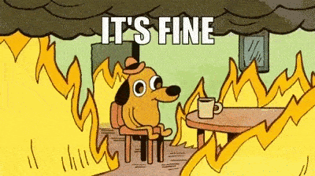
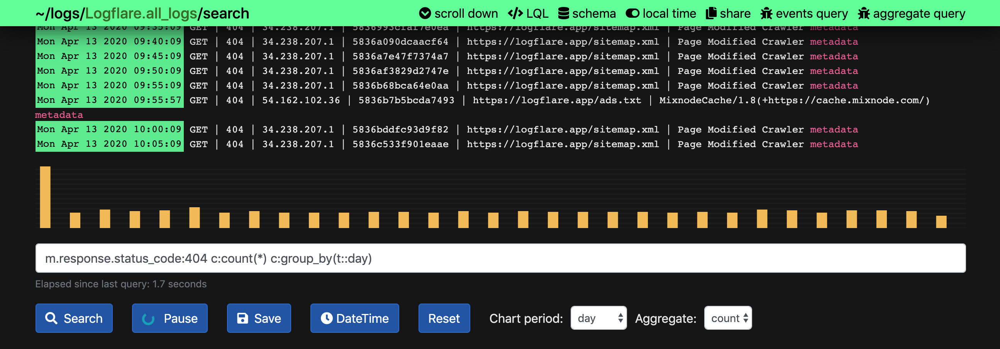
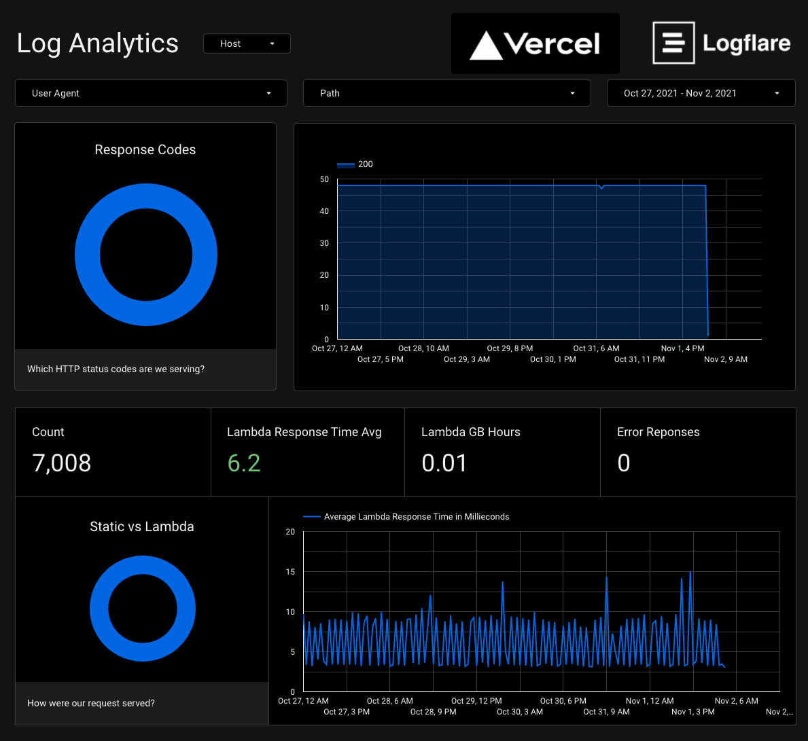

**Logging**, **monitoring** and **alerting** is a very important piece when deploying software. In my experience, it's important that best practices are implemented at an early stage of a project. Whenever code is changed we should make sure that we are:

1. **Logging** everything that could be out of interest
2. **Monitoring** different metrics, such as errors
3. **Alerting** the developers whenever an error occur

If done correctly, any error would be apparent to the developer / business at an early stage and could be solved right away. If not, "silent errors" will occur and cause your application to fail and result in a poor user experience.

### 1) 🧾 Logging

```
As a develooper
I want to be able to see a log of notable events
So that I can analyse and debug what's happening
```

### 2) ☕️ Monitoring

```
As a developer
I want to have an overview of important metrics
So that I can see how we are doing
```

### 3) 🚨 Alerting

```
As a developer
I want to be notified if a particular event occurs
So that I can act on that information
```

### Getting rid of silent errors

Silent errors are errors that do not trigger any kind of reporting, and therefore occur without you knowing about it. They are usually reported by the users themselves - which is a very bad user experience and poor for business.

### Errors will happen, let's stay on top of them

When building an application you are often dealing with a third party that you are not in control of. In this case it's important that we gracefully deal with them and get an alert so that we can fix them if possible.

### Don't fix the silent error right away

Whenever you are made aware of silent error, the first instinct might be to fix the problem right away. I will argue that the first action should be to gracefully deal with the error and make sure that we are logging it in an appropriate way.

1. Can I find this error in the logs?
2. Should I monitor this error?
3. Should I have received an alert?

By addressing the "logging" aspects first, you should have a better visibility of the error before you go ahead and fix it. This will make the codebase much more stable and the developer experience will be much better in the long term. I've worked with products where almost no errors were monitored and it resulted in a product where errors frequently would appear, and probably even more silent errors that were never even reported.

### A practical example

Let's say that a third party API failed, resulting in the application crashing I recommend you to:

1. Make sure to gracefully deal with the error and if necessary display a human readable error message to the user
2. Make sure that you log the error
3. Make sure that you get an alert when the error occurs
4. Start monitoring the error (and possibly similar errors)

**..and only when this is done you can fix the problem.**

Ofcourse there are scenarios where a hotfix is necessary, but ignoring the steps above will most likely result in a codebase where errors similar to the one that showed up will occur in the future. If you make sure to address the logging, you ensure that you stay on top of errors in the future and can fix them as soon as possible. The time spent setting up a good standard for logging will result in a better product, happier developers and more time to work on actual features.

### What tools to use?

**There are tons of tools out there for logging, monitoring and alerting - and what's best for you depends on your tech stack.** For one of our latest projects which is a web application built with [`Next.js`](https://nextjs.org) and deployed through [Vercel](https://vercel.com) we are using the tools below.

#### 1) Logging to [LogFlare](https://logflare.app)



We are logging to [LogFlare](https://logflare.app) using [Vercel](https://vercel.com) where we have configured LogFlare as a [log drain](https://vercel.com/blog/log-drains). You can find more about the Logflare integration with Vercel [here](https://logflare.app/guides/vercel-setup).

#### 2) Monitoring with [Google Data Studio](https://datastudio.google.com)



We are using [Google Data Studio](https://datastudio.google.com) to generate reports that we can monitor. We are doing this by connecting Logflare as a datasource. It's super easy to create charts for the metrics you need to monitor.

#### 3) Error Reporting to [Sentry](https://sentry.io)


We are tracking errors using [Sentry](https://sentry.io). We will catch any runtime errors in our React application as well as our backend API. We also manually log specific errors that might occur. Whenever a new error occur an alert will be sent to Slack.
