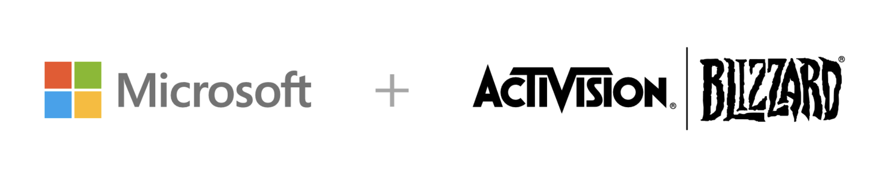

```

                            6
                        Microsoft

                      3          3
                 Flat Capital  Apple
                    (NEW!)

           2          2          2          2
        Alphabet    Amazon      BMW        Meta
                                          (NEW!)

      1          1          1          1          1
     AMD       Exxon      Nordea     Nvidia     Shopify
```

### TL;DR

- Sold PayPal and bought Meta
- Sold Activision Blizzard and bought Flat Capital
- Downgraded BMW and upgraded Apple
- Downgraded Shopify
- I sit with 75% in stocks and 25% in cash
- Microsoft will be my captain going forward as well

### Q4 Earning Reports

Below is a summary of the Q4 earnings. Most companies had great fourth quarters. It was cool to see that Exxon, who had the worst performance in 2020, absolutely crushed it in 2021. **All amounts expressed in millions of dollars.**

| Name                |   Revenue | Y/Y (%) | Net Income | Profit Margin |
| :------------------ | --------: | ------: | ---------: | ------------: |
| Activision Blizzard |   \$2,160 |  -10.32 |      \$564 |        26.07% |
| AMD                 |   \$4,830 |   48.77 |      \$970 |        20.18% |
| Alphabet            |  \$75,330 |   32.39 |   \$20,640 |        27.40% |
| Amazon              | \$137,410 |    9.44 |   \$14.320 |        10.42% |
| Apple               | \$123,950 |   11.22 |   \$34,630 |        27.94% |
| BMW                 |  \$27,470 |    4.52 |    \$2,560 |         9.33% |
| Exxon Mobil         |  \$84,970 |  144.20 |    \$8,870 |        10.44% |
| Meta                |  \$33,670 |   19.95 |   \$10.290 |        30.55% |
| Flat Capital        |         - |       - |          - |             - |
| Microsoft           |  \$51,730 |   20.09 |   \$18,770 |        36.28% |
| Nordea              |   \$2,270 |    3.89 |    \$1,020 |        44.80% |
| Nvidia              |   \$7,103 |   50.30 |    \$2,464 |        34.70% |
| PayPal              |   \$6,920 |   13.11 |      \$801 |         11.58 |
| Shopify             |   \$1,120 |   46.43 |    \$1,150 |          102% |

Below you can read some factual information together with some of my personal opinions about the companies.

### Activision Blizzard (Sold)

> OK Q4, revenue coming in at $2.2 billion (-10.32% y/y) with a net income of $564 million (26.07% profit margin). However, the big news is that it was announced on January 18th that Activision Blizzard will be acquired by Microsoft in 2023.



For the last six months I've been thinking of downgrading ATVI from 3 to 1 due to the organizational problems and the "not too exciting"-pipeline. But then on January the 18th Microsoft announced that it is planning on acquiring Activision Blizzard for $67.8 billion, or $95 per share - which was a 45% premium to the then current share price. I think this is yet another smart acquisition of MSFT. For more information on this deal I recommend you to read this well written article by Jonathan Weber for Seeking Alpha; [Microsoft Takes Out Activision: Everything You Need To Know](https://seekingalpha.com/article/4480128-msft-takes-out-atvi).

I've chosen to sell my shares in Activision Blizzard to free up some cash. I'm happy about the fact that I'll continue to own Activision Blizzard through Microsoft in the future.

### AMD (Hold: 1)

> Great Q4, revenue was \$4.8B, up 49% year over year. Profit margin of 20.18%. Computing and Graphics segment revenue was \$2.6 billion, up 32 percent year-over-year and up 8% quarter-over-quarter. Enterprise segment revenue was \$2.2 billion, up 75% year-over-year and 17% quarter-over-quarter driven by higher EPYC™ and semi-custom processor sales. Press release can be found [here](https://ir.amd.com/news-events/press-releases/detail/1044/amd-reports-fourth-quarter-and-full-year-2021-financial).

AMD continues to have a strong market position in the Computing and Graphics segment, even I bought a Radeon processor this year, **AMD Ryzen 5 5600X**. And the fact it's Enterprise segment is growing (even though I don't know much about it) tells a good story.

However, compared to Intel, AMD comes with a hefty price tag; Intel has a P/E ratio of 9.92 compared to AMD at 48.07. Intel also gives 3.03% in yearly dividend. While Intel is five times bigger than AMD in terms of revenue, its growth has stagnated the last four years. **I'm actually tempted to own both AMD and Intel in the future.**

### Alphabet (Hold: 2)

> Good Q4, increased revenue of 32% year over year to $75.3 billion. A net income of $20.6 billion (28% margin). You can find the Press Release [here](https://abc.xyz/investor/).

It's amazing how much Google is growing. If we look at the different segments we can see growth in all of them. However, it should be noted that they are not yet profitable on Google Cloud.

- **Google Search:** \$43.3 billion (+36%)
- **YouTube ads:** \$8.6 billion (+25%)
- **Google Network:** \$9.3 billion (+25%)
- **Google Cloud:** \$5.5 billion (+44%)
- **Google other:** \$8.2 billion (+22%)

### Amazon (Hold: 2)

> Net sales increased 9% year-over-year to $137.4 billion in the fourth quarter. Net income increased to $14.3 billion (10.42% profit margin). However, the core business is actually not profitable. You can find the Press Release and Webcast [here](https://ir.aboutamazon.com/quarterly-results/default.aspx).

The net income of $14.3 billion is actually a bit deceptive, since $11.8 billion of that is from Amazon's investment in Rivian. If you disregard that, net income is $3.1 billion (2.26% profit margin). Also, Amazon's core business (amazon.com) reported a combined operating loss of $1.8 billion during the quarter.

The highlight is the growth and profit from AWS, where revenue increased to \$17.8 billion for the quarter (+40% increase y/y), with a profit margin of 30%. That's great, and I believe that AWS will keep growing in the years to come.

Amazon is one of the more pricier stocks that I own with a P/E of 48. I will hold for now, but I'm keeping a close eye on the profit margins of its core business. Might downgrade to a 1. I recommend reading this article; [Amazon's Q4: The Good, The Bad, And The Ugly](https://seekingalpha.com/article/4484217-amazons-q4-the-good-the-bad-and-the-ugly) by Jonathan Weber.

### Apple (Upgrade: 3)

> Great Q4, revenue up 11 percent year-over-year to $124 billion. $34.63 billion in net income (27.9% profit margin). You can find the press release [here](https://investor.apple.com/investor-relations/default.aspx).

Looking at the entire year, sales have grown 33% for the entire product lineup compared to 2020. The issues in China have been resolved and we could see a 70% increase in sales compared to 2020. I love my Macbook Air. The Airtags saved me from forgetting my backpack and missing a flight. If I lost my AirPods I wouldn't hesitate buying a new pair. Just such a solid company.

### BMW (Downgrade: 2)

> Stable Q3 despite the challenging situation with semiconductor supply, revenue came in at €27.5 billion for Q3 (4.5% Y/Y), and net income of €2.9 billion (9.33% profit margin). BMW sold 593 117 cars during Q3 (-12.2% Y/Y). You can find the conference call, press release etc [here](https://www.bmwgroup.com/en/investor-relations/financial-reports.html).

For the last three trailing months of 2021, BMW has sold more than 1.9 million cars, which is an 18% increase y/y compared to 2020. Out of these 12% were electrified vehicles. The motorcycle segment also performed well this period, delivering 156 thousand units (+20.8% y/y). Profit for the first three months of 2021 comes in at €10.9 billion (13.2% profit margin) which is good.

I like BMW as a brand and I think the underlying numbers are very good. The big question is; how will BMW perform in ten to twenty years? The transition to electric vehicles will be critical and in my opinion BMW is doing a good job with that. Between January and September 2021, 231 575 all-electric and plug-in hybrid vehicles were delivered to customers (+98.9% increase y/y). Out of these, 59 688 were all-electric (+121.4% y/y).

### Exxon Mobil Corp (Hold: 1)

> Great Q4, revenue of $84.97b (+83.89 increase), earnings of $8.9 billion, resulting in full-year earnings of \$23 billion. You can find the Press Release [here](https://corporate.exxonmobil.com/Investors/Investor-relations).


Last year when Exxon struggled I decided to downgrade Exxon from a 2 to 1 (see blog post [here](https://random.md/blog/stocks-update)), although hoping for a recovery in 2021. And boy, did they recover. Exxon generated $48 billion of cash flow operating activities in 2021 - which is the highest level since 2012. They paid of $20 billion in debt and still managed to grow the dividend for the 39th consecutive year.

With Exxon performing so well in 2021, I will continue to hold the stock. I'll end with a quote from one of my favorite movies; [There Will Be Blood](https://www.imdb.com/title/tt0469494/), featuring Daniel Day-Lewis; **_I’m an oil man, ladies and gentlemen._**

### Meta (New: 1)

> Good Q4, revenue of $33.7 billion (+20% y/y) and a net income of $10.3 billion (30.55% profit margin). You can find the Press Release [here](https://investor.fb.com/investor-events/default.aspx).

Almost all revenue for Meta is from advertising. Beginning this quarter Meta started to report their financial results based on two reportable segments:

<iframe width="560" height="315" src="https://www.youtube.com/embed/gElfIo6uw4g" title="YouTube video player" frameborder="0" allow="accelerometer; autoplay; clipboard-write; encrypted-media; gyroscope; picture-in-picture" allowfullscreen></iframe>

1. **Family of Apps (FoA)**, which includes Facebook, Instagram, Messenger, WhatsApp and other services
2. **Reality Labs (RL)**, which includes augmented and virtual reality related consumer hardware, software and content.

Even though it's the advertising business from their **Family of Apps** segment that is bringing in all the cash, it is **Reality Labs** segment and metaverse that gets me going. They will continue to lose money on this segment for many years to come, but if the world becomes anywhere near what Meta thinks it will most likely be a great bet for them. Here is a podcast recorded in a virtual reality studio with avatars from Meta; [VR Download: Meta Revenue Report, Microsoft Turmoil, Tobii PSVR2 Negotiations](https://www.youtube.com/watch?v=B6Um07YoqSU).

### Flat Capital (New: 3)

> Flat Capital is a Swedish investment company founded by Nina and Sebastian Siemiatkowski in 2013. They have invested in [14 companies](https://www.flatcapital.com/en/investments/) as of today with a total value of 196,4 million SEK. The company is valued at 770 million SEK, so you are paying a hefty premium around 293%.

I love Flat Capital's investment strategy where they invest in the founders on a long term basis which you can read more about [here](https://www.flatcapital.com/en/about-us/). I believe that Sebastian, who is also CEO of Klarna, has great experience from the startup world as well as a great network that will help them find new investment ideas. This is a great way for me to get the chance to invest in unlisted companies and I plan to own Flat Capital for many years to come.

### Microsoft (Hold: 3)

> Good Q3, with revenue of $51.7 billion (20% increase Y/Y) and a net income of $18.8 billion (36.28% margin). You can find the Press Release and Webcast [here](https://www.microsoft.com/en-us/Investor/earnings/FY-2022-Q2/press-release-webcast).

Microsoft keeps growing in all their respective segments.

- **Productivity and Business Process** revenue for the quarter was \$15.9 billion (+19% y/y). LinkedIn increased its revenue with 37%. Office Commercial and Consumer products grew 14 and 15 percent respectively.
- **Intelligent Cloud** revenue for the quarter was \$18.33 billion (+26% y/y) with a gross margin percentage of 70%. Azure has indeed a bigger market share than Amazon's AWS. I actually got to interact with Azure a bit during a client project - using a white labeled version of Github and interacting with some MYSQL databases hosted on Azure
- **More Personal Computing** revenue for the quarter was $17.5 billion (+15% y/y) with more Windows OEM licenses sold together with a growth in gaming revenue of $411 million.

Microsoft has acquired [14 companies in 2021](https://www.microsoft.com/en-us/Investor/acquisition-history.aspx), and announced in January that they are [acquiring Activision Blizzard](https://news.microsoft.com/2022/01/18/microsoft-to-acquire-activision-blizzard-to-bring-the-joy-and-community-of-gaming-to-everyone-across-every-device/). My feeling with Microsoft is that they are growing in more directions than the other tech giants such as Apple or Google. While I appreciate Apple's tighter product line, I can also enjoy Microsoft's more diverse bets into things such as GitHub, Xbox and gaming, LinkedIn, etc. Happy to hold Microsoft for many years to come most likely.

### Nordea (Hold: 1)

> Good Q4, with revenue of €2.4 billion (10% increase Y/Y) and a net income of €1.3 billion (45% profit margin). Press Release and financial report can be found [here](https://www.nordea.com/en/investors).

A good value stock that compliments my portfolio that contains a lot of growth stocks. Not much to say really.

### Nvidia (Hold: 1)

> Good Q3, revenue of $7.10 billion (+50% y/y) and a net income of $2.5 billion (34.7% profit margin). Record Data Center revenue of $2.94 billion, up 55 percent from a year earlier. Record Gaming revenue of $3.22 billion, up 42 percent from a year earlier. You can find more information [here](https://investor.Nvidia.com/financial-info/quarterly-results/default.aspx).

<iframe width="560" height="315" src="https://www.youtube.com/embed/fVaDO8ek57Q" title="YouTube video player" frameborder="0" allow="accelerometer; autoplay; clipboard-write; encrypted-media; gyroscope; picture-in-picture" allowfullscreen/></iframe>

The world is becoming more and more digital. While Facebook changed name to Meta and are building out the metaverse, Nvidia is working on [NVIDIA Omniverse™](https://www.nvidia.com/en-us/omniverse/) which aims to be the standard for 3d and virtual collaboration in the future.

All of this feels very much like science fiction, but I'm quite sure that the future will require a lot of graphic cards. Nvidia has a P/E of 73.93, which makes it one of the most pricy companies in my portfolio, but I won't sell as long as they keep growing.

### PayPal (Sold)

> OK Q4, revenue of $6.92 billion (13.11% increase Y/Y) and a net income at $801 million billion (11.58% profit margin). Number of payment transactions grew to 5.3 billion (+21% y/y). For the whole of 2021 there were 19.3 billion transactions (+25%). You can find the Press Release and Webcast [here](https://investor.pypl.com/home/default.aspx)

Seems to me like the growth of PayPal is slowing down a bit. Living in Sweden, you rarely interact with PayPal or its other brands such as Venmo or iZettle. I pay with my debit card, Apple Pay or Swish. I like to understand and use the products of the companies that I invest in, and for that reason I've decided to sell my shares in PayPal.

### Shopify (Hold: 2)

> Total revenue in the third quarter was $1.12 billion (+46% y/y), where $336 million came from Subscription solutions and \$787 million from Merchant solutions. I recommend reading the [Shopify Investor Deck](https://s27.q4cdn.com/572064924/files/doc_financials/2021/q3/Shopify-Investor-Deck-Q3-2021.pdf) for the quarter.

Nothing new really from Shopify. I believe in the company and their products. Will hold as long as they keep growing.
